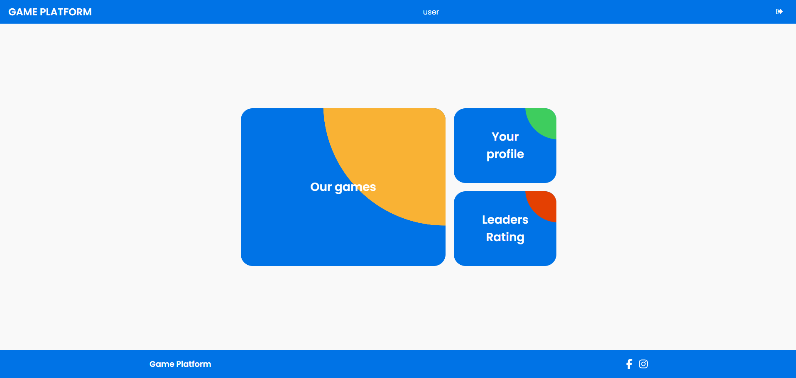

# WebGamesPlatform

WebGamesPlatform is a full stack application for playing various games online with both friends and strangers for rating. The main idea is that people will compete with each other in who will have the highest rating point every month.


## Features

- **Online system** - connection to the game session, restoration of the game session, completion of the game session.
- **Rating and season system** - every month a new season will start and the rating of the participants will be reset. For each victory or defeat in the game, the participant will be awarded or deducted points
- **Match history** - each player can view their match history.
- **Penalty system** - in case of leaving the game, the player will be deducted a certain number of points depending on the number of participants, and the remaining participants will be awarded a certain number of points
- **Profiles** - each player has a profile that can be viewed. It can be open or closed, which affects the amount of visible information.
- **Architecture** - allows you to quickly add new games and features
## Startup

Application can be started via docker compose

```bash
  docker compose up
```
But before that, you need to create and configure volumes    
## Volumes Configuration
The volumes folder must have the following mandatory subfolders
- **reverse-proxy**. Must contain nginx.conf. See nginx.conf.example
- **resources**. Should contain resources that can be accessed through domain/resources
- **certs**. Must contain certificates for api gateway and keycloak. Can be changed in docker-compose and nginx.conf
## Screenshots



